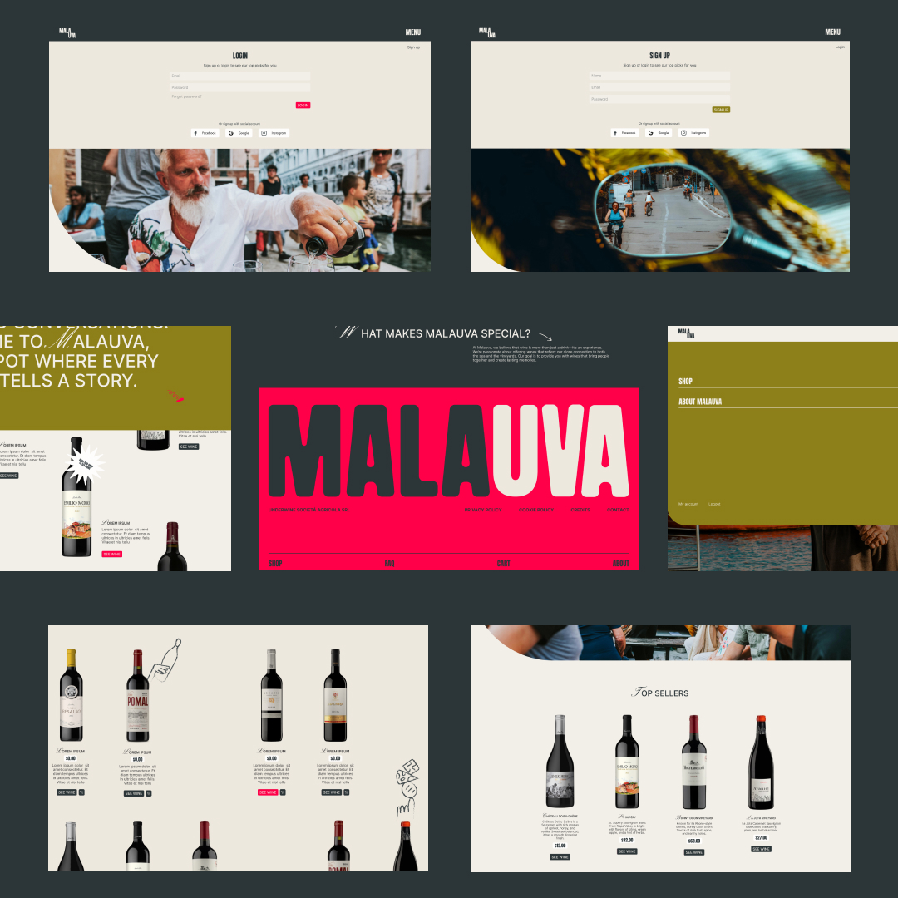
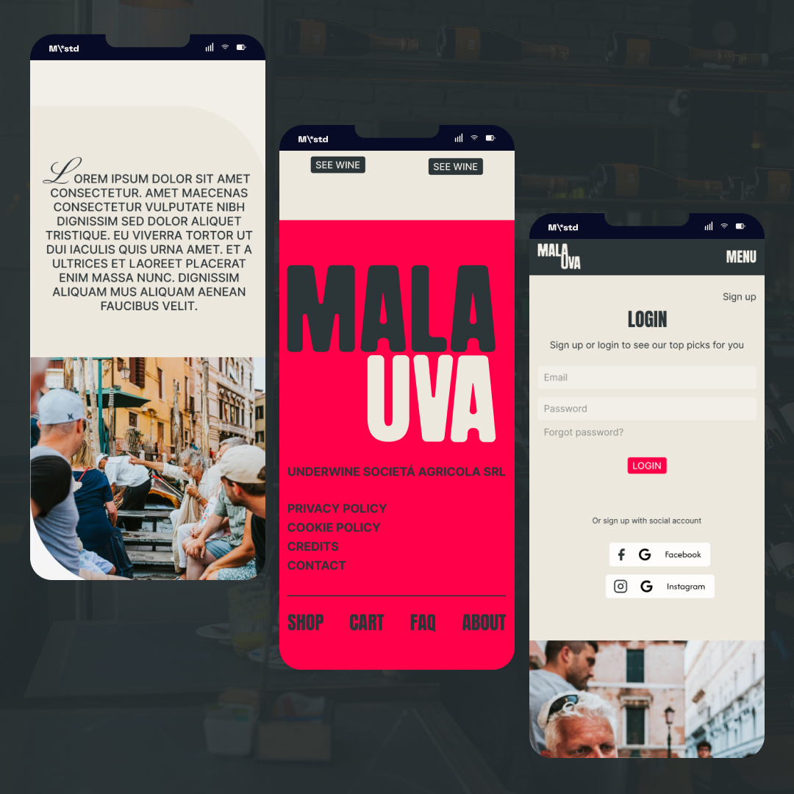
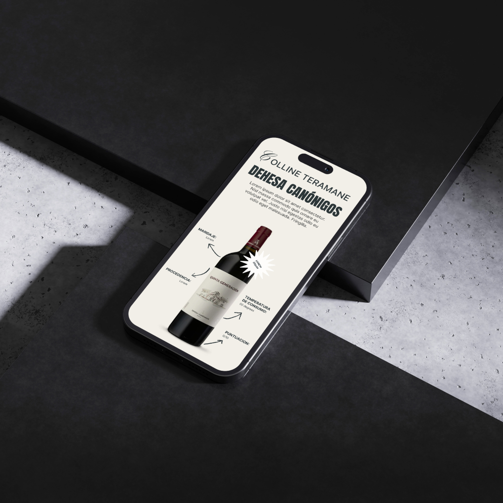
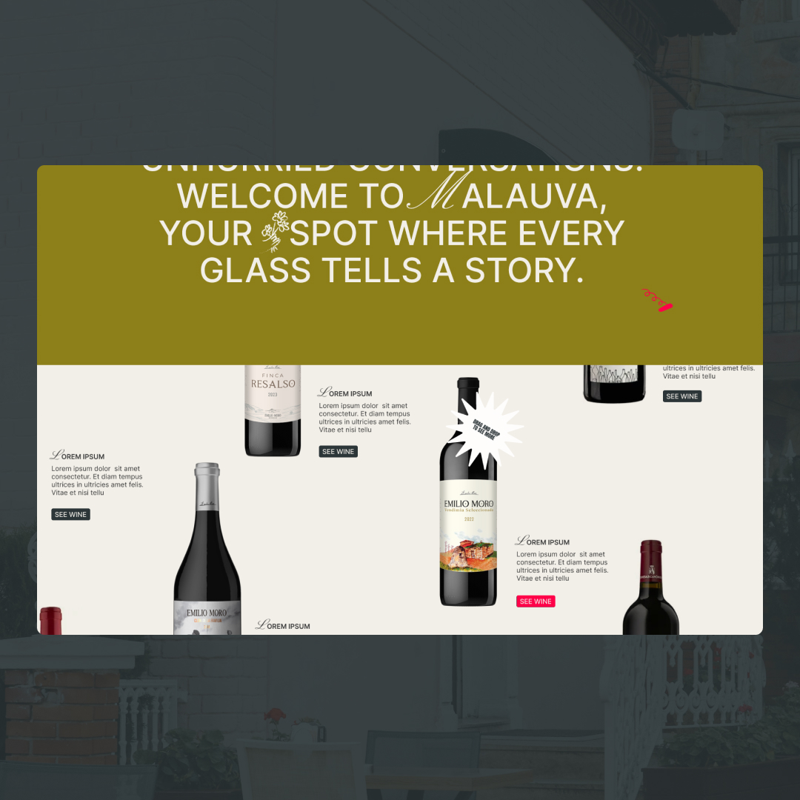

# MalaUva FrontEnd

Current state: MVP  
Version: v0.1  

MalaUva is a wine cellar online, focused on bringing the wine lifestyle to modern audiences by being a place where everyone can feel understood in terms of tastes.







## Table of Contents
- [MalaUva FrontEnd](#malauva-frontend)
  - [Table of Contents](#table-of-contents)
  - [Overview](#overview)
  - [Features](#features)
  - [Technologies Used](#technologies-used)
  - [Installation](#installation)
  - [Usage](#usage)
  - [Project Structure](#project-structure)
  - [Tech Stack](#tech-stack)

## Overview
MalaUva is a React-based frontend application designed to provide users with an immersive experience in exploring wines, their stories, and the lifestyle associated with them. The platform aims to make wine culture accessible and enjoyable for everyone, regardless of their level of expertise.

## Features
- **User-friendly Interface**: Intuitive design for easy navigation.
- **Wine Exploration**: Browse and discover wines based on preferences.
- **Storytelling**: Highlighted sections for wine stories and culture.
- **Responsive Design**: Optimized for desktop, tablet, and mobile devices.
- **Dynamic Routing**: Seamless navigation between pages like Home, About, and Signup.

## Technologies Used
- **Frontend Framework**: React
- **Styling**: CSS/SCSS
- **State Management**: Context API
- **Routing**: React Router
- **Build Tool**: Vite
- **Version Control**: Git

## Installation
To set up the project locally, follow these steps:

1. Clone the repository:
   ```bash
   git clone <repository-url>
   ```

2. Navigate to the project directory:
```bash
cd malauva-frontend
```

3. Install dependencies: 
```bash
npm install
```

## Usage
To start the development server, run:

```bash
npm run dev
```
The application will be available at http://localhost:3000.

To build the project for production, use:

```bash
npm run build
```

## Project Structure
```
src/
├── components/         # Reusable UI components
│   ├── elements/       # Smaller UI elements
│   ├── pages/          # Page-level components
├── data/               # Global variables and constants
├── reducers/           # Redux-like reducers for state management
├── router/             # Application routing
├── utils/              # Utility functions, hooks, and contexts
├── App.tsx             # Main application component
├── main.tsx            # Entry point of the application
public/
├── assets/             # Static assets like images and fonts
```

## Tech Stack


